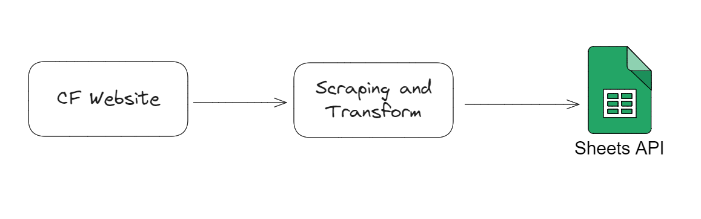
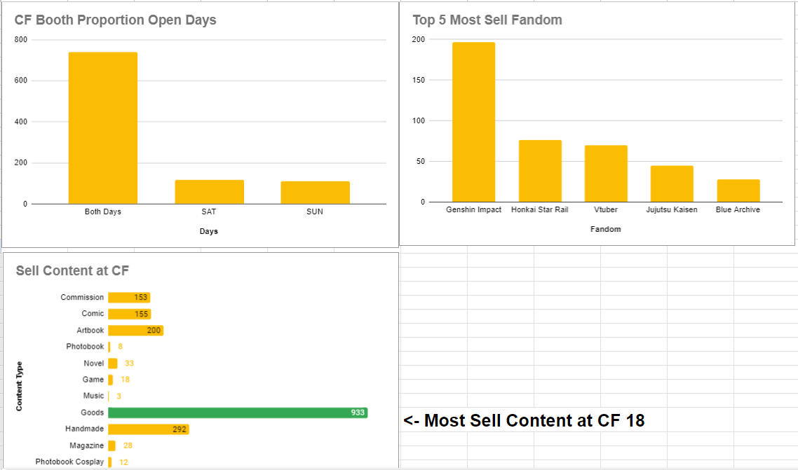

# **Scraping Catalog CF 18**
---

Target Scraping: https://catalog.comifuro.net/

Output Spreadsheet: [CF Catalog Spreadsheet](https://docs.google.com/spreadsheets/d/1FsRe6uMCihiFX1CVFEHOG1N8r-l2vPAI7Q7HmIZ3jis/edit?usp=sharing)

### **Goals**
---
- Karena buka website Catalog CF super duper lemot, akhirnya saya bikin data pipeline buat extract data dan load ke spreadsheet biar gampang akses nya
- Sehingga user tidak perlu menunggu lama untuk load web catalog, karena nanti data akan ditaruh di Google Spreadsheet dan terdapat Summary Dashboard
- *Alasan lain biar ngelatih skill Scraping*
- Harapannya script ini bisa dipakai lagi untuk next CF (apabila struktur HTML nya tidak berubah)

### **Constraint & Findings**
---
- Karena web CF menggunakan React, jadi sangatlah painful untuk understanding struktur HTML
- Ketika iseng tembak URL pakai Postman, turns out React ngebungkus all JSON data di `window.__INITIAL_STATE__`
- Jadi cukup get tag tersebut, dan parsing jadi text dan maen Regex untuk ambil data JSON
- Apabila ada data terbaru, cukup jalankan secara manual script `catalog_data_pipeline.py`
- Awalnya kepikiran pakai AWS Lambda atau sejenisnya buat trigger / schedule script per hari nya. Tapi malas dan ribet setup nya, jadi cukup trigger manual di tiap hari nya.

### **Workflow**
---

### **Mini Summary Dashboard (hehe...)**
---

Tabik
Tepe